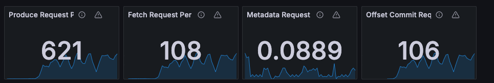
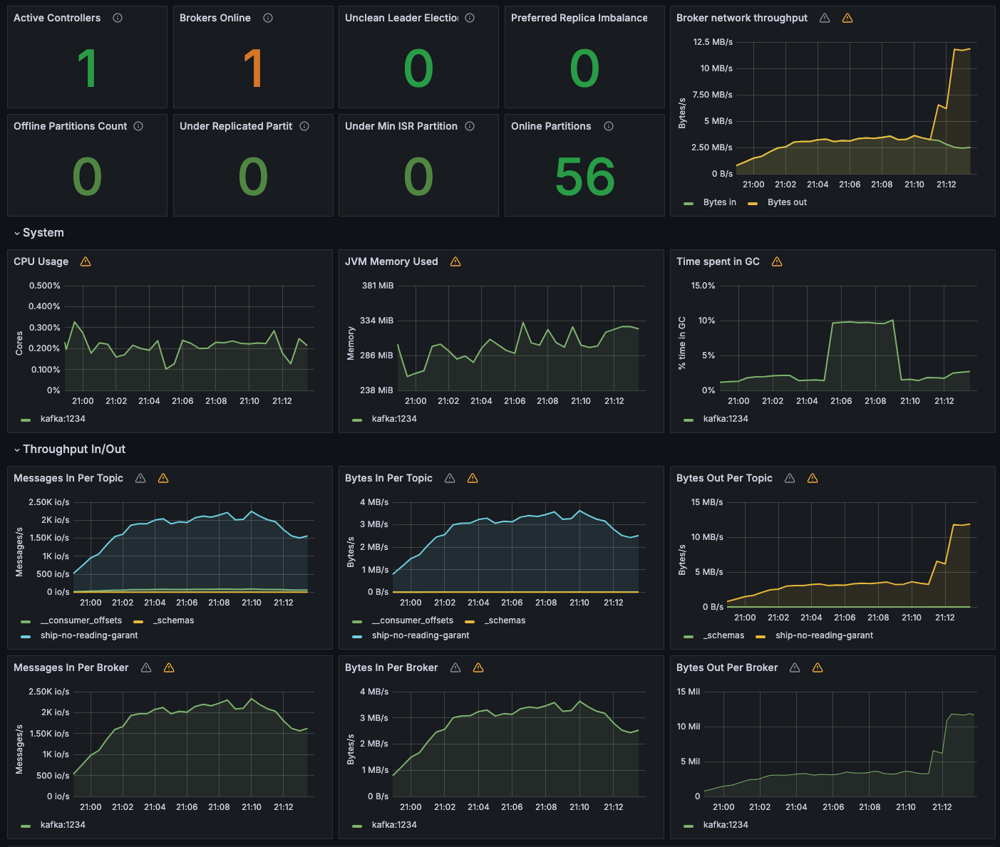
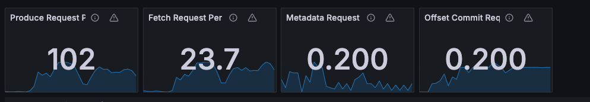
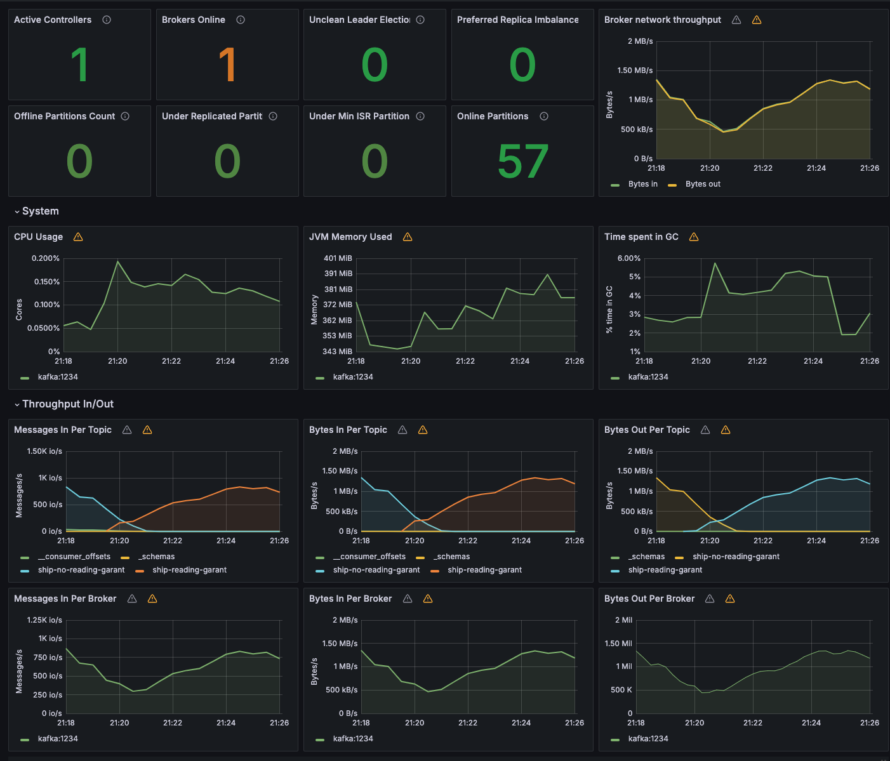
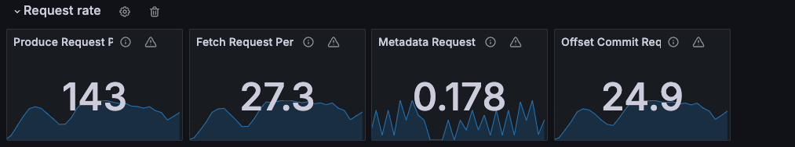
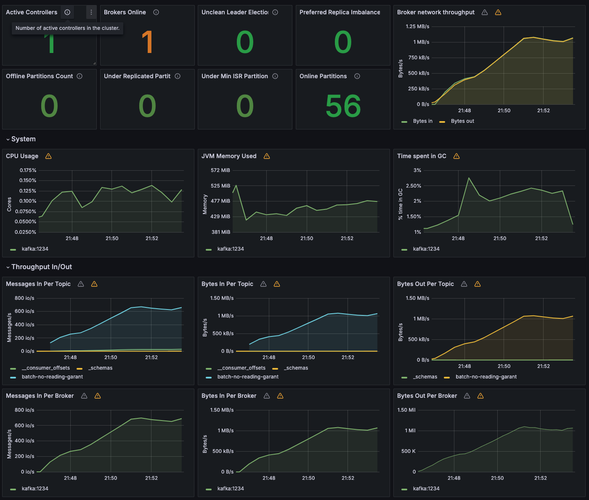
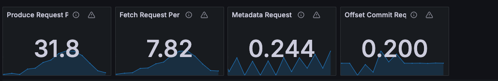
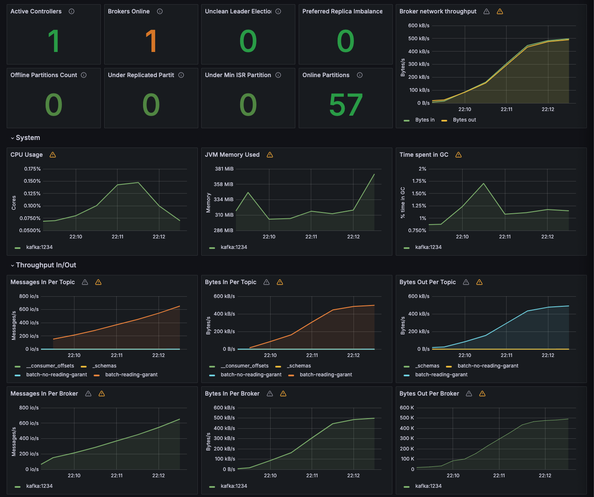

# Kafka practice

## Table of contents

## Introduction

В данном проекте рассматривается работа с Apache Kafka. В качестве примера рассматривается
отправка и чтение сообщений из топиков. Также рассматривается работа с Avro схемами.

## Kafka

## Experiment results

| Топик                                | java profile | RPS Чтения | RPS Отправки | Описание Данных                                                 |
|:-------------------------------------|--------------|:----------:|:------------:|-----------------------------------------------------------------|
| `ship-no-reading-garant`             | snrg         |    100     |     590      | Отправка без гарантии чтения                                    |
| `ship-reading-garant`                | srg          |     25     |     150      | Отправка с гарантией чтения                                     |
| `batch-no-reading-garant`            | bnrg         |     35     |     200      | Пакетное чтение без гарантии чтения                             |
| `batch-reading-garant`               | brg          |     25     |     120      | Пакетное чтение с гарантией чтения                              |
| `batch-filter-listen-reading-garant` | bflrg        |            |              | Пакетное чтение с фильтром в листенере с рарантией чтения       |
| `batch-filter-consum-reading-garant` | bfcrg        |            |              | Пакетное чтение с фильтром внутри консьюмера с гарантией чтения |
| `ship-avro`                          | sa           |            |              | Отправка данных через авро                                      |

### `ship-no-reading-garant`

Average Produce RPS: 590
Average Consume RPS: 100

### `ship-reading-garant`

Average Produce RPS: 150
Average Consume RPS: 25

### `batch-no-reading-garant`

Average Produce RPS: 200
Average Consume RPS: 35

### `batch-reading-garant`

Average Produce RPS: 120
Average Consume RPS: 25

### `batch-filter-listen-reading-garant`

Average Produce RPS:
Average Consume RPS:

### `batch-filter-consum-reading-garant`

Average Produce RPS:
Average Consume RPS:

### `ship-avro`

Average Produce RPS:
Average Consume RPS:

## Docker

| Service         | port  | version     |
|-----------------|-------|-------------|
| zookeeper       | 2181  | 6.2.4       |
| kafka           | 29092 | 6.2.4       |
| schema-registry | 8085  | 6.2.4       |
| kafka-ui        | 8080  | v0.7.2      |
| postgresql      | 5432  | 14.7-alpine |
| pgadmin         | 5050  | 7           |
| prometheus      | 9090  | v2.52.0     |
| grafana         | 3000  | 10.4.3      |

## Kafka parameters

### Acks

| acks | Throuput | Latency | Durability  |
|------|----------|---------|-------------|
| 0    | high     | low     | No garantee |
| 1    | medium   | medium  | leader      |
| -1   | low      | high    | isr         |

### Batch.size

Больше размер батча -> больше степень сжатия, выше пропускная способность
Больше размер батча -> больше задержка в общем случае

### Compression.type

Алгоритм для сжатия сообщений

### Max.in.flight.requests.per.connection

Если параметр больше 1 -> большая пропускная способность
Если параметр больше 1 -> возможность нарушения порядка сообщений в случае отказа

## Kafka metrics

Lag by Consumer Group
Message in per second
Message consume per second
Transaction commits
Transactions rollbacks
